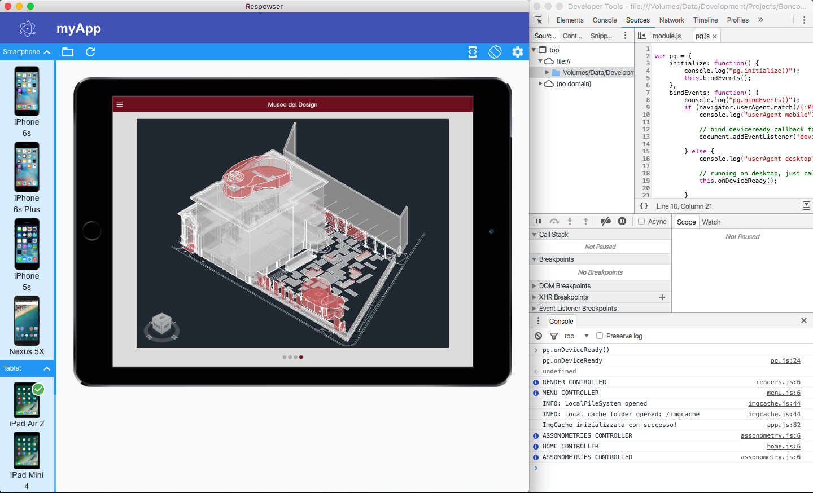
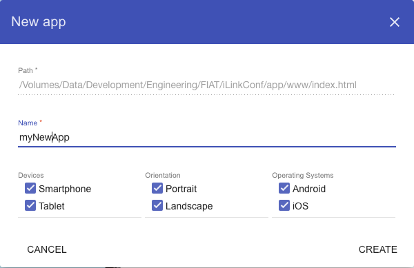

#Respowser

Respowser is an [Electron](http://electron.atom.io/) app written with [Angular Material](https://material.angularjs.org/latest/)
for single page application testing, using different smartphones and tablets real frame.

## Using

### Define new app

Start it and use the Open button to load an existing single page application by selecting its main `index.html` file.
Configure your app's name and all device's info:

 - **Type**: smartphone and/or tablet
 - **Orientation**: portrait and/or landscape
 - **Operating** system: Android and/or iOS

 

Now start using your application in Respowser exactly as you would on the mobile phones or tablet.

To change the device settings you can use the "Settings" button on the right side of toolbar.

### Change and use devices

Respowser allows to use different devices to test your app, so you can view it inside the real device
frame in an immersive and charming mode.
Its actual version of Respowser includes the following smartphones and tablets:

 - iPhone 6s
 - iPhone 6s Plus
 - iPhone 5s
 - Nexus 5X
 - iPad Air 2
 - iPad Mini 4
 - Nexus 9
 - Galaxy Tab S2 9.7"

You can also use all device in portrait or landscape mode, if your app is configured properly.

### Develper Tools

Respowser is awesome to test single page application's using the real and complete Chrome DevTools witch
 is included with all its features like:

 - Inspect, add and remove HTML elements and change CSS style
 - Read every console log and errors with colored sintax
 - Watch source and use realtime debug experience, with breakpoints and so on
 - View all network request infos, like url, headers, response, during time and even more
 - Using Timeline and Profile to check app performance
 - Direct access to Service Workers and Storage systems

If you dont want the user can open Chrome Developer Tools you just edit `core/config.js` configuration file and set
`canOpenDevTools` to `false`.

## Embedded app

You can also use Respowser with a single page application embedded into tis build.
To do that you can only follow these simple steps:

 - Copy all single page application's source inside `client/www` directory
 - Open `core/config.js` configuration file and set `canOpenOtherApps` to `false`
 - Config you single page application using `core/app.js`:

    - _name_: the app name
    - _url_: the url of main `index.html` page
    - _lastDevice.model_: device model name (from `client/devices/devices.list.json`)
    - _lastDevice.orientation_: device default orientation [`ORIENTATIONS.PORTRAIT`, `ORIENTATIONS.LANDSCAPE`]
    - _compatibility.orientations_: all allowed orientations [`ORIENTATIONS.PORTRAIT`, `ORIENTATIONS.LANDSCAPE`]
    - _compatibility.types_: all allowed orientations [`DEVICES.TYPES.SMARTPHONE`, `DEVICES.TYPES.TABLET`]
    - _compatibility.oss_: all allowed orientations [`DEVICES.OSS.IOS`, `DEVICES.OSS.ANDROID`]